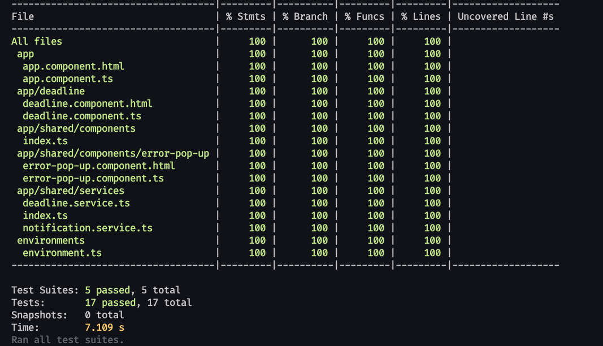

# Angular Countdown App with Node.js Backend

### Table of Contents

- [Overview](#overview)
- [Getting Started (Local Development)](#getting-started-local-development)
- [Features](#features)
  - [Frontend (Angular):](#frontend-angular)
  - [Backend (Node.js):](#backend-nodejs)
- [Project Structure](#project-structure)
  - [Frontend](#frontend)
  - [Backend](#backend)
- [FAQ](#faq)
- [Demo Images](#demo-images)

### Overview

This project is a simple Angular application with a backend server built using Node.js and Express. The application demonstrates a countdown timer to a deadline, where the backend provides the deadline in seconds. The application handles real-time updates using RxJS in Angular, signals, and follows best practices in coding and testing.

## Getting Started (Local Development)

1. Navigate to the server folder:
   ```bash
   cd server
   ```
2. Install the dependencies:
   ```bash
   npm install
   ```
3. Start the server:
   ```bash
   npm start
   ```
4. Open a new terminal and navigate to the front-end folder:
   ```bash
   cd front-end
   ```
5. Install the dependencies:
   ```bash
   npm install
   ```
6. Start the Angular application:
   ```bash
   npm start
   ```
7. Open a browser and navigate to http://localhost:4200 to view the application.
8. To run the tests, navigate to the front-end folder and run:
   ```bash
   npm test
   ```

## Features

### Frontend (Angular):

1. Countdown Timer:
   - Displays a countdown timer with seconds left to the deadline.
   - Indicates when the deadline has passed.
2. Signal Management:
   - Utilizes Angular signals to manage the current date dynamically.
3. Responsive UI:
   - Styled with Tailwind CSS for a clean and responsive design.
4. Change Detection:
   - Uses ChangeDetectionStrategy.OnPush for optimized performance.
5. Testing:
   - Includes comprehensive unit tests using Jest for both components and services.
6. If backend is not available, the app will display a message indicating that there is no connection to the server.

### Backend (Node.js):

1. Deadline Generation:
   - A manual deadline can be set using the MANUALLY_SET_DEADLINE environment variable.
   - If no manual deadline is set, a random deadline (up to 2 days in the future) is generated dynamically.
2. CORS Support:
   - Backend includes CORS middleware to allow cross-origin requests.
3. Custom Deadline API:
   - /api/deadline endpoint returns the number of seconds left until the deadline.
   - Example:
   ```json
   {
     "deadline": 123456
   }
   ```
4. Dynamic Deadline Management:
   - Handles deadlines both manually set and randomly generated.

## Project Structure

### Frontend

- app.component.ts: Root component of the Angular application.
- deadline.component.ts: Component handling the countdown timer and deadline display.
- deadline.service.ts: Service for communicating with the backend.

### Backend

- server.js: Main entry point for the backend server.
- .env: Configuration for environment variables.

## FAQ

1. What happens if I manually edit the deadline?
   - If you manually edit the MANUALLY_SET_DEADLINE environment variable or change backend logic, restart the backend server to reflect the changes.

## Demo Images



