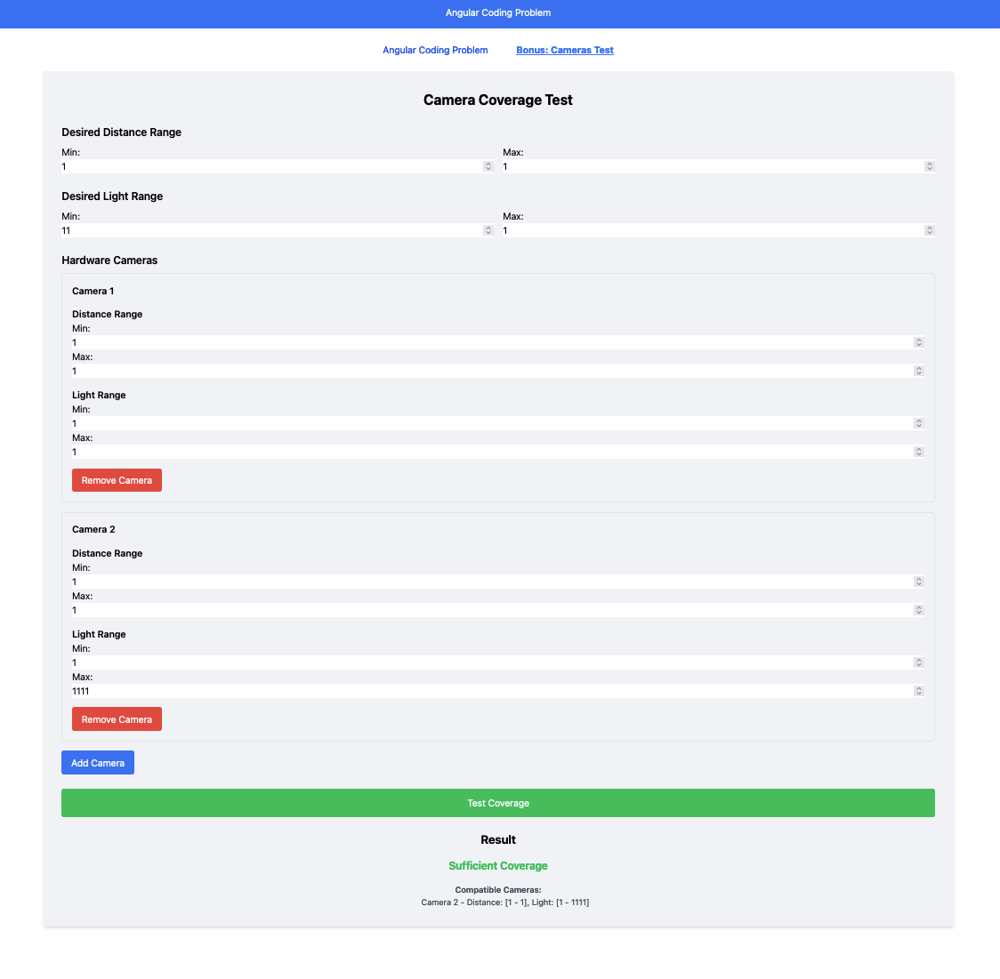

# General coding problem

The author of this story problem is neither a photographer nor a hardware engineer, so please forgive any implausibility.

1. Suppose we want to construct a versatile software camera by combining many inflexible hardware cameras.
2. Each hardware camera works well for a particular range of subject distances and for a particular range of light levels.
3. The software camera will measure the light level and subject distance of each shot and choose an appropriate hardware camera to capture it.
4. There are many hardware cameras on the market, and we are considering various proposals for which ones to include in our design.

Write a function that takes the desired characteristics of the software camera (range of subject distances and range of light levels that it should support) and a list of hardware cameras with their respective characteristics, and tests whether that set of hardware cameras will suffice.

## Example Test

For testing the function, you can run in the terminal:

```bash
node problem.js
true
false
false
false
```

## Live Demo

Go to the first folder where the angular project is, follow the instructions in the README.md file, and go to

http://localhost:4200/cameras-test to see the live demo.

## Image of the live demo


